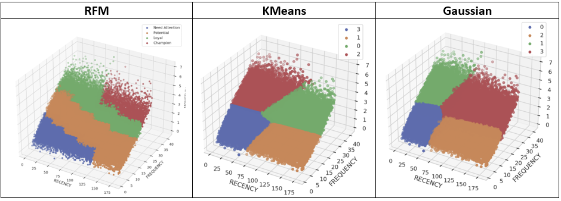

# Segmentation Custom Materialization dbt Package

This dbt package provides a materialization that segments customers or any other entities.

It builds SQL or Python (Snowpark) transformation from SQL dbt model. Basically, you provide your own custom SQL in dbt SQL model, configure a segmentation type and the package compiles the SQL, and creates a dbt SQL or Python model which is run in a usual dbt workflow. SQL can contains ref() or source() or other macros. It's compiled before running in the final Python model.

This is a lightweight approach designated for automated processing relatively small and simple data batches without complex feature preprocessing. It can be used to apply a segmentation algorithm on a full data set. 

KMeans and Gaussian clustering models can be tuned, trained and saved in Snowflake Model Registry and re-used for inference in incremental loads. But the problem is transforming the data using the same approach as was used for the trained model. It requires additional steps in the workflow, transformations, maybe, using a feature store.


## What does this dbt package do?

There are 3 main segmentation types:

- **RFM** groups customers based on their recency (when was the customers last purchase?), frequency (How many orders did the customer place within a given time frame?) and monetary value of purchases. This is the simplest segmentation type, and it creates an SQL dbt model from orders totals in the base model SQL.
- **KMeans** clustering accepts any numerical columns. The package creates a Python dbt model based on SQL dbt model provided. The numerical features are scaled and KMeans algorithm is applied.
- **Gaussian** clustering also accepts any numerical columns and creates a Python dbt model based on SQL dbt model provided. The numerical features are scaled, normalized if needed (Anderson-Darling test is used) and GaussianMixture algorithm is applied.

You can provide only the number of clusters to get segmented data in the output table or add more specific clustering model parameters.

2 more segmentation types designed for a mix of varchar (categorical) and numerical columns. An example of such data is customer demographic (gender, marital status etc.) and purchase amount.

- **DBSCAN**
- **AgglomerativeClustering**

Both algorithms apply Gower distance transformation and require an additional Python package installed in your Snowflake environment.

The transformation is slow, resource consuming and works only with small amounts of data.

The created clusters are not very useful. And if AgglomerativeClustering requires just one parameter - number of clusters, DBSCAN should be tuned with 2 parameters.

In addition, Snowflake Model registry does not allow to save the model and re-use for incremental loads.

The package also allows using **_custom segmentation type_** with your own algorithm. A custom macro with SQL or Python can be created and the name of the macro used in **segmentation_type** configuration parameter.

The package uses _all columns in the provided SQL as features except the column configured as_ **_unique_key_**_._

## How do I use the dbt package?

### Step1: Prerequisites

To use this dbt package, you must have the following

- Snowflake
- Data with a unique key and numerical columns

Optional: Only if you want to try clustering of varchar and numerical columns together you need to have [Gower Python package](https://pypi.org/project/gower/) available in Snowflake.

- Gower.zip is available in this repository python_library folder.
- Copy this file to a location (S3 bucket in AWS Cloud as an example), for which you have a Snowflake stage.
- Later add in you model configuration this parameter:

```

imports=['@your_stage_name/gower.zip']

```
See also https://docs.snowflake.com/en/developer-guide/udf/python/udf-python-packages#importing-packages-through-a-snowflake-stage

The rest will be done by the macros in the package.

### Step 2: Install the package

Include dbt_segmentation_tools package in your packages.yml file.

```

packages:

- git: "https://github.com/KaterynaD/dbt_segmentation_tools"

```

and run

```

dbt deps

```


### Step 3: Configure dbt model

#### RFM Model

Requires a customer unique id (unique_key) and customers order totals by date.

Minimum configuration:

```

{{ config(

materialized='segmentation',

segmentation_type='RFM',

unique_key = 'o_custkey',

orderdate= 'o_orderdate',

ordertotal = 'o_totalprice'

) }}

select

o_custkey ,

o_orderdate ,

o_totalprice

from {{ source('tpch_sf1', 'orders') }}

```

You can specify more details.

```

{{ config(

materialized='segmentation',

segmentation_type='RFM',

unique_key = 'o_custkey',

segment_col_name='RFM_segment',

segments = ['Champion','Loyal','Potential','Need Attention'],

segments_limits = [13,10,6,0],

quintile = 5,

method = '+',

orderdate= 'o_orderdate',

ordertotal = 'o_totalprice',

period_of_interest_in_days = 180

) }}

select

o_custkey ,

o_orderdate ,

o_totalprice

from {{ source('tpch_sf1', 'orders') }}

```

#### KMeans Model

```

In the minimum configuration you need unique_key and number of clusters. All columns in the SQL except unique_key will be used as features in KMeans model.

Only numerical features are accepted.

{{ config(

materialized='segmentation',

segmentation_type='KMeans',

unique_key = 'o_custkey',

n_clusters = 4

) }}

select

o_custkey ,

RECENCY,

FREQUENCY,

MONETARY

from {{ ref('RFM') }}

```

More parameters can be provided:

```

{{ config(

materialized='segmentation',

segmentation_type='KMeans',

unique_key = 'o_custkey',

segment_col_name='KMeans_segment',

n_clusters = 4,

max_iter=100,

init = 'k-means++'

) }}

```

#### Gaussian model

In the minimum configuration you need unique_key and number of clusters. All columns in the SQL except unique_key will be used as features in the model.

Only numerical features are accepted.

```
{{ config(

materialized='segmentation',

segmentation_type='Gaussian',

unique_key = 'o_custkey',

n_components= 4

) }}

select

o_custkey ,

RECENCY,

FREQUENCY,

MONETARY

from {{ ref('RFM') }}

```

#### DBSCAN

DBSCAN requires **eps** and **min_samples**. Metric parameter is 'precomputed' because the package uses Gower distance matrix. See more details in scikit-learn DBSCAN documentation. This algorithm requires a lot of tuning because in most cases you will get 1 cluster or 1 large cluster and few more tiny clusters.

Make sure you have **gower.zip** available in a Snowflake stage.

Start experiments from tiny datasets, no more than 1000 records. It accepts varchar and numerical columns in SQL.

``` 
{{ config(

materialized='segmentation',

segmentation_type='DBSCAN',

unique_key = 'c_customer_sk',

segment_col_name='DBScan_segment',

imports=['@control_db.external_stages.my_python_library/gower.zip'],

eps = 0.1,

min_samples=5

) }}

select

c.c_customer_sk,

2003 - c.c_birth_year age,

d.cd_gender,

d.cd_marital_status,

d.cd_education_status

from {{ source('tpcds_sf100tcl', 'customer') }} c sample(1000 rows)

join {{ source('tpcds_sf100tcl', 'customer_demographics') }} d

on d.cd_demo_sk=c.c_current_cdemo_sk

```

#### Agglomerative Clustering

This algorithm also accepts varchar and numerical columns but does not require tuning as DBSCAN.

You need to provide only **n_clusters** and can try different **linkage** parameter values (average by default). Metric parameter is 'precomputed' because the package uses Gower distance matrix. See more details in scikit-learn AgglomerativeClustering documentation.

Make sure you have **gower.zip** available in a Snowflake stage.

Start experiments from tiny datasets, no more than 1000 records.

```

{{ config(

materialized='segmentation',

segmentation_type='AgglomerativeClustering',

unique_key = 'c_customer_sk',

segment_col_name='Agg_segment',

imports=['@control_db.external_stages.my_python_library/gower.zip'],

linkage = 'complete'

n_clusters = 5

) }}

```

#### Custom algorithm

You can create your own macro with any name and use it in **segmentation_type** parameter:

If a macro creates SQL code, the name must contain **SQL**.

For Python macro, the name must contain **Python** and the macro defines Python model function.

SQL custom segmentation type:

```

{{ config(

materialized='segmentation',

segmentation_type='RFM_custom_SQL',

unique_key = 'o_custkey',

recency = 'Recency',

frequency = 'Frequency',

monetary = 'Monetary_Avg',

segment_col_name='RFM_custom_segment',

) }}

select

o_custkey ,

Recency,

Frequency,

Monetary_Avg,

from {{ ref('RFM') }}

```

And the macro:

```



...



```

The details are in macros/segmentation_SQL_custom.sql The file name can be any.

Python custom segmentation:

```

{{ config(

materialized='segmentation',

segmentation_type='custom_python',

unique_key = 'o_custkey',

segment_col_name='random_segment',

n_clusters = 25

) }}

```

And the corresponding macro is

```



...

def model(dbt, session):

...

    return final_sdf



```

The details are in macros/ segmentation_Python_custom.sql The file name can be any.

### Step 4: Run dbt

```

dbt run

```

## Custom Materialization Essential Source Code snippets

What makes the package interesting from the dbt programming point of view is how I compile the final dbt model into SQL or Python.

Dbt makes a choice base on the model file extension - sql or py.

I use segmentation_type:

```
...



SQL materialization



Python materialization


...

```

SQL Custom Materialization is straightforward:

```





{{ create_table_as(False, target_relation, build_sql, 'sql') }}



```

Python Custom Materialization besides calling the macro itself requires additional steps to build additional functions to be able to run it in Snowflake

```

...

{# I do need these additional Python packages in my models #}

{# They must be in the model configuration to be properly processed by dbt into SnowPark code #}





{# This custom macro creates Python model function #}

{# The original dbt model SQL is already compiled at this moment. #}

{# It means you can use ref and source or other macros as usual to be transered in Python code. #}



{# These code creates additional Python functions to run dbt model in SnowPark #}

{{ build_ref_function(model) }}

{{ build_source_function(model) }}

{{ build_config_dict(model) }}

{{ py_script_postfix(model) }}

{{ create_table_as(False, target_relation, python_compiled_code, 'python') }}



```

You can find more details in Macros/segmentation_materialization.sql

Few more code snippets of interest:

Modification of a dbt model configuration in a macro:

```



```

To run a custom macro by name from a parameter or variable:

```



```

## Data Segmentation Examples

The package includes sample models based on Snowflake sample data provided. The data are synthetic, huge and supposed to be used for performance evaluation.

RFM, KMeans and Gaussian (numerical only) models are based on snowflake_sample_data.tpch_sf1.orders table. The examples of the clusters created:




The target tables contain all columns from the initial SQL dbt model plus a Segment column. The name can be customized in the model configuration.

To demo DBSCAN and AgglomerativeClustering I used sample 1000 rows from tpcds_sf100tcl.customer and tpcds_sf100tcl. customer_demographics tables from snowflake_sample_data database.

Because the data are synthetic, demographic data has the same number of samples in each categorical feature. The data is not clustered well. In RFM_and_Demographics notebook, I artificially change the data to get more distinguishable clusters. It did not help a lot. With few categorical features and 1 numerical, DBSCAN tries to create as many clusters as there are combinations of values in categorical columns. If there are manageable number of segments, there are always 1 large, and 1 or few tiny-tiny.